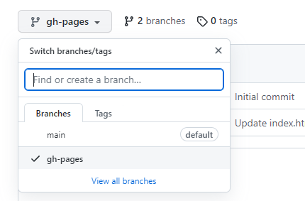
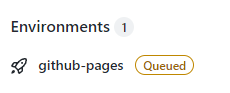
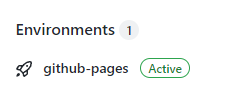

# Floating Assignment: Cheat Sheet hosted by Github Pages

This should become the home for your WMC 'Cheat Sheet' - your personal knowledge base about HTML, CSS and other web technologies.   
The goal is to host the cheat sheet as web page on Github and access it directly from your repository.

To achieve this goal, the following preparations are required:
- Clone your assignment repository (already done, right? ;)
- Create and checkout a branch named 'gh-pages':
  - Git CLI ```$ git checkout -b gh-pages``` is a short-hand command for:
- Create branch named 'gh-pages' in Git
  - Git CLI: ```$ git branch gh-pages```
  - TortoiseGit: 'Create Branch'
- Switch to that branch:
  - Git CLI: ```$ git checkout gh-pages```
  - TortoiseGit: 'Git Switch/Checkout'
- Create an ```index.html``` or modify the existing one
- Commit and push the repository (especially the branch 'gh-pages') as usual
-__!Check on Github (via browser)__ if
  - you can see the branch 'gh-pages'
  - switch to that branch and see if your latest changes in 'index.html' are available on this branch 
- Your web page should be accessible via URL ```https://if-03-01-2bhif-wmc-2223.github.io/<name-of-your-repo>```, e.g. [Template Repository Page](https://if-03-01-2bhif-wmc-2223.github.io/floating-assignment-cheat-sheet-pages-template/) after a while
- Check if Github pages are enabled
  - Deployment is on the way: 
  - Deployment can be accessed via URL: 

## Important:
Your repository MUST be public (and is therefore readable by anyone) to make it accessible via Github pages.
